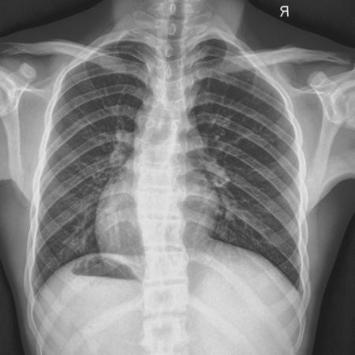

# Visão Geral da Identificação de Doenças Cardiopulmonares por Meio de Raio-X

## Contexto

O diagnóstico de doenças cardiopulmonares é uma tarefa crucial na prática médica, e o raio-X de tórax (ou radiografia torácica) é uma das ferramentas mais utilizadas para essa finalidade.

## Anatomia do Pulmão

Este segmento detalha as principais estruturas anatômicas dos pulmões, fornecendo uma base sólida para o diagnóstico e a classificação de doenças por meio de raio-X.

### Estruturas Principais

- **Lóbulos Pulmonares**:
  - **Pulmão Direito**: Dividido em três lóbulos — superior, médio e inferior.
  - **Pulmão Esquerdo**: Dividido em dois lóbulos — superior e inferior.
  
- **Tronco Brônquico**:
  - **Brônquio Principal Direito**: Mais vertical e mais largo que o esquerdo.
  - **Brônquio Principal Esquerdo**: Mais curto e com ângulo mais agudo em relação ao esôfago.

- **Bronquíolos**:
  - Estruturas menores que os brônquios, responsáveis pela condução do ar até os alvéolos.

- **Alvéolos Pulmonares**:
  - Pequenas sacolas de ar onde ocorre a troca gasosa entre oxigênio e dióxido de carbono.
  
- **Pleura**:
  - **Pleura Visceral**: Membrana que cobre a superfície dos pulmões.
  - **Pleura Parietal**: Membrana que reveste a cavidade torácica.
  - **Cavidade Pleural**: Espaço entre as duas pleuras, preenchido por líquido pleural que reduz o atrito durante a respiração.

- **Mediastino**:
  - Região central do tórax que contém o coração, grandes vasos sanguíneos, traqueia, esôfago e linfonodos.

- **Diafragma**:
  - Músculo em forma de cúpula que separa a cavidade torácica da cavidade abdominal, desempenhando um papel crucial na respiração.

- **Artérias Pulmonares**:
  - Transportam sangue pobre em oxigênio do coração para os pulmões para a oxigenação.

- **Veias Pulmonares**:
  - Transportam sangue oxigenado dos pulmões de volta para o coração.

- **Sistema Nervoso Autônomo**:
  - Controle involuntário das funções respiratórias e vasculares dos pulmões.

## Importância do Raio-X no Diagnóstico Cardiopulmonares

O raio-X de tórax é uma das primeiras ferramentas de imagem utilizadas na avaliação de pacientes com sintomas respiratórios ou cardíacos. Ele fornece informações valiosas sobre:

- **Estruturas Ósseas**: Detecta fraturas ou anormalidades ósseas.
- **Coração**: Avalia o tamanho e a forma do coração.
- **Pulmões**: Identifica opacidades, padrões de ventilação e outras anormalidades pulmonares.
- **Mediastino**: Analisa as estruturas centrais do tórax, como vasos sanguíneos e linfonodos.
- **Pleura**: Detecta derrames pleurais ou pneumotórax.

## Anatomia Normal

Esta seção representa um tórax saudável sem evidências de anormalidades. É fundamental para o treinamento do modelo, servindo como referência para a comparação com imagens patológicas.

#### Características Radiológicas

- **Coração**: Tamanho e contorno normais.
- **Pulmões**: Transparência normal, sem opacidades ou consolidações.
- **Pleura**: Sem derrames pleurais ou espessamentos.
- **Mediastino**: Estruturas mediastinais normais, sem desvio ou alargamento.
- **Diafragma**: Forma e posição normais, sem elevação ou abaulamento.

## Processos Inflamatórios Pulmonares (Pneumonia)

Pneumonia é uma infecção que inflama os sacos de ar nos pulmões, podendo preenchê-los com líquido ou pus, dificultando a respiração

#### Características Radiológicas

- **Consolidação**: Áreas opacas homogêneas nos pulmões, indicando preenchimento alveolar.
- **Perfil Lobar**: Consolidação que abrange um lobo pulmonar específico.
- **Bordas Mal Delimitadas**: Limites difusos entre áreas consolidadas e saudáveis.
- **Air Bronchogramas**: Brônquios visíveis através da consolidação alveolar.
- **Localização**: Comumente afeta os lóbulos inferiores e a base dos pulmões.

## Maior Densidade (Derrame Pleural, Consolidação Atelectásica, Hidrotórax, Empiema)

Condições que apresentam áreas de maior densidade nos pulmões ou na cavidade pleural, indicando a presença de fluidos ou processos de consolidação.

#### Características Radiológicas

- **Derrame Pleural (Pleural Effusion)**:
  - Áreas opacas nas bases pulmonares.
  - Curvatura do diafragma elevada.
  - Sinal do menisco (curvatura do líquido).
  - Ausência de broncogramas aéreos.

- **Consolidação Atelectásica**:
  - Aumento da densidade pulmonar.
  - Desvio do mediastino para o lado afetado.
  - Redução do volume pulmonar.
  - Presença de broncogramas aéreos.

- **Hidrotórax**:
  - Similar ao derrame pleural, com maior densidade homogênea.
  - Pode ocorrer simetria bilateral.

- **Empiema**:
  - Sinais semelhantes ao derrame pleural com possível loculações.
  - Presença de espessamentos pleurais.

## Menor Densidade (Pneumotórax, Pneumomediastino, Pneumoperitônio)

Condições caracterizadas por áreas de menor densidade, indicando a presença de ar em locais anormais.

#### Características Radiológicas

- **Pneumotórax (Pneumothorax)**:
  - Linha pleural visível com ausência de pulmão ao redor.
  - Ponto de absorção (apical pneumotórax) como uma pequena área de ar.
  - Desvio do mediastino para o lado oposto em casos de pneumotórax tensionado.

- **Pneumomediastino (Pneumomediastinum)**:
  - Sinal do anel de ar (ar ao redor do coração e dos grandes vasos).
  - Sinal do contínuo de artéria pulmonar (ar ao longo da artéria pulmonar).
  - Elevado índice de vasculatura pulmonar.

- **Pneumoperitônio (Pneumoperitonium)**:
  - Níveis de ar/fluido em decúbito (sinais de Nível Hidroaéreo).
  - Elevação do diafragma com ar subdiaphragmatico.
  - Ausência de cólica gasosa normal no abdômen.

## Doenças Pulmonares Obstrutivas (Enfisema, Broncopneumonia, Bronquiectasia, Embolia)

Doenças que envolvem a obstrução do fluxo de ar nos pulmões, dificultando a respiração e alterando as características radiológicas.

#### Características Radiológicas

- **Enfisema**:
  - Aumento do diâmetro anteroposterior do tórax (sinal de barril).
  - Desdobramento das costelas (sinal de derradeira).
  - Aparecimento de retrocavações.
  - Diminuição da densidade pulmonar geral.

- **Broncopneumonia (Bronchopneumonia)**:
  - Opacidades localizadas, frequentemente peribronciais.
  - Padrão multifocal ou segmentar.
  - Possível presença de abscessos ou consolidações.

- **Bronquiectasia**:
  - Asas de ar (brônquios expandida).
  - Opacidades devido a infecções recorrentes.
  - Padrão de "cartuchos de cigarro" nos pulmões inferiores.

- **Embolia Pulmonar (Pulmonary Embolism)**:
  - Geralmente não específica, mas pode mostrar:
    - Tártaro de Hampton (opacidade triangular no hilário pulmonar).
    - Diminuição do diâmetro das artérias pulmonares.
    - Desvio do mediastino para o lado oposto.

## Doenças Infecciosas Degenerativas (Tuberculose, Sarcoidose, Proteinose, Fibrose)

Doenças infecciosas e degenerativas que afetam os pulmões, resultando em alterações radiológicas específicas.

#### Características Radiológicas

- **Tuberculose (Tuberculosis)**:
  - Opacidades nodulares ou cavitárias, especialmente nos ápices pulmonares.
  - Adenopatia hilar e mediastinal.
  - Sinais de fibrose ou calcificações secundárias.

- **Sarcoidose**:
  - Adenopatia hilar bilateral.
  - Padrão reticular intersticial.
  - Fibrose em estágios avançados (padrão de seta ou “padrão de tracheia-bronquiectasia”).
  - Nódulos pequenos espalhados.

- **Proteinose (Pulmonary Alveolar Proteinosis)**:
  - Opacidades em vidro fosco bilateral.
  - Padrão de “batata frita” ou “crazy-paving” (interstícios espessados com opacidades alveolares).
  - Volume pulmonar geralmente preservado.

- **Fibrose Pulmonar (Pulmonary Fibrosis)**:
  - Padrão reticular ou nodular intersticial.
  - Aperto do volume pulmonar.
  - Sinal de silhueta perdida (alterações na silhueta cardíaca e diafragmática).
  - Engessamento das costelas.

## Lesões Encapsuladas (Abscessos, Nódulos, Cistos, Massas Tumorais, Metastases)

Lesões encapsuladas são áreas delimitadas de alteração tecidual dentro dos pulmões, que podem ser benignas ou malignas.

#### Características Radiológicas

- **Abscessos Pulmonares (Lung Abscess)**:
  - Cavidades arredondadas com paredes espessas e nítidas.
  - Presença de ar líquido (air-fluid levels) dentro da cavidade.
  - Localização geralmente periférica.

- **Nódulos Pulmonares (Pulmonary Nodules)**:
  - Menor que 3 cm de diâmetro.
  - Margens bem definidas ou irregulares.
  - Podem ser benignos (granulomas) ou malignos (carcinoma metastático ou primário).

- **Cistos Pulmonares (Pulmonary Cysts)**:
  - Áreas redondas ou ovaladas com densidade aérea.
  - Margens finas e bem definidas.
  - Podem ser congênitos ou adquiridos.

- **Massas Tumorais (Tumor Masses)**:
  - Maior que 3 cm.
  - Bordas irregulares ou espiculadas.
  - Presença de calcificações pode indicar tumor benigno (como hamartoma) ou maligno.

- **Metástases Pulmonares (Pulmonary Metastases)**:
  - Múltiplos nódulos disseminados.
  - Variedade de tamanhos e formas.
  - Podem estar localizados em qualquer parte dos pulmões.

## Alterações de Mediastino (Pericardite, Malformações Arteriovenosas, Linfonodomegalias)

Alterações no mediastino indicam mudanças nas estruturas centrais do tórax, afetando órgãos como o coração, grandes vasos e linfonodos.

#### Características Radiológicas

- **Pericardite**:
  - Aumento da silhueta cardíaca.
  - Espessamento do contorno cardíaco.
  - Sinais indiretos como derrame pericárdico.

- **Malformações Arteriovenosas (Arteriovenous Malformations)**:
  - Opacidades nódulares ou em cavidade.
  - Possível presença de calcificações.
  - Pode haver aumento de fluxo sanguíneo.

- **Linfonodomegalias Mediastinais (Mediastinal Lymphadenopathy)**:
  - Massa opaca nas regiões hiliar e mediastinal.
  - Deslocamento das estruturas adjacentes.
  - Pode indicar infecções, sarcoidose ou neoplasias.

## Alterações do Tórax (Atelectasias, Malformações, Agenesia, Hipoplasias)

Esta seção engloba diversas condições que causam alterações na estrutura e volume do tórax.

#### Características Radiológicas

- **Atelectasias**:
  - Opacidades lineares ou em massa.
  - Desvio do mediastino para o lado afetado.
  - Diminuição do volume pulmonar.

- **Malformações Congênitas**:
  - Presença de deformidades torácicas.
  - Alterações no posicionamento dos órgãos internos.
  - Podem incluir traqueia-esôfago, esternes ou costelas malformadas.

- **Agenesia Pulmonar**:
  - Tórax unilateral com ausência de sinal pulmonar.
  - Desvio do mediastino para o lado afetado.
  - Aumento do pulmão oposto.

- **Hipoplasia Pulmonar**:
  - Pulmões menores do que o normal.
  - Redução da densidade pulmonar.
  - Possível presença de síndromes associadas (como a síndrome de Potter).
